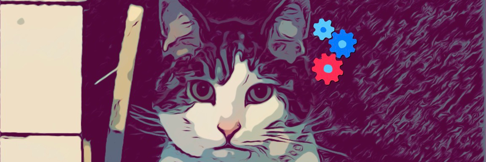

<h3 align="center">
Hi there, I'm Matthew.
</h3>

Software Engineer! Started in DoD and moved to private SaaS.

My bread and butter is creating elegant solutions, debugging gnarly problems, and being able to talk about why it is important.

👉<a href="matthewaerose.github.io">Github Page</a>👈

---

